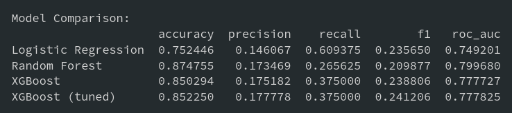

# Laporan Proyek Machine Learning - Prediksi Stroke

## Domain Proyek

### Latar Belakang
Stroke merupakan salah satu penyakit yang menjadi penyebab kematian terbanyak di dunia. Menurut World Health Organization (WHO), stroke adalah penyebab kematian nomor dua secara global, bertanggung jawab atas sekitar 10% dari total kematian di seluruh dunia [1]. Di Indonesia sendiri, stroke menempati urutan pertama sebagai penyebab kematian dengan prevalensi 10,9 per 1000 penduduk [2].

Stroke terjadi ketika suplai darah ke otak terganggu atau berkurang, sehingga jaringan otak kekurangan oksigen dan nutrisi. Dalam hitungan menit, sel-sel otak mulai mati, menyebabkan berbagai gangguan neurologis yang bisa berakibat fatal atau menyebabkan kecacatan permanen. Deteksi dini faktor risiko stroke sangat penting untuk pencegahan dan manajemen penyakit tersebut.

Beberapa faktor risiko stroke yang telah diidentifikasi melalui berbagai penelitian medis termasuk hipertensi, penyakit jantung, diabetes (yang tercermin dari tingkat glukosa darah), obesitas (BMI tinggi), merokok, usia lanjut, dan jenis kelamin [3]. Memahami kontribusi masing-masing faktor risiko ini sangat penting untuk strategi pencegahan dan intervensi dini.

Machine learning menawarkan pendekatan yang menjanjikan untuk mengidentifikasi individu yang berisiko tinggi terkena stroke berdasarkan kombinasi faktor risiko. Dengan menganalisis data medis dan demografis secara komprehensif, algoritma machine learning dapat membantu tenaga medis mengidentifikasi pasien yang membutuhkan perhatian lebih dan intervensi proaktif.

Proyek ini bertujuan untuk mengembangkan model prediksi stroke yang dapat membantu para profesional kesehatan dalam melakukan skrining awal dan mengidentifikasi pasien yang berisiko tinggi. Implementasi model prediktif semacam ini dalam sistem layanan kesehatan berpotensi meningkatkan upaya pencegahan, mengurangi angka kejadian stroke, dan pada akhirnya menyelamatkan nyawa.

### Referensi:
[1] World Health Organization. (2020). "The top 10 causes of death". https://www.who.int/news-room/fact-sheets/detail/the-top-10-causes-of-death

[2] Kementerian Kesehatan RI. (2018). "Hasil Utama Riskesdas 2018". https://repository.badankebijakan.kemkes.go.id/id/eprint/3514/1/Laporan%20Riskesdas%202018%20Nasional.pdf

[3] Boehme, A. K., Esenwa, C., & Elkind, M. S. (2017). "Stroke Risk Factors, Genetics, and Prevention". Circulation Research, 120(3), 472-495. https://doi.org/10.1161/CIRCRESAHA.116.308398

## Business Understanding

### Problem Statements
Berdasarkan latar belakang di atas, berikut adalah rumusan masalah yang akan diselesaikan dalam proyek ini:
1. Faktor-faktor apa saja yang memiliki korelasi tinggi dengan kejadian stroke?
2. Bagaimana cara memprediksi risiko stroke seseorang berdasarkan faktor demografis dan kondisi kesehatan?
3. Seberapa akurat model machine learning dapat memprediksi risiko stroke?

### Goals
Tujuan dari proyek ini adalah:
1. Mengidentifikasi faktor-faktor yang memiliki korelasi signifikan dengan risiko stroke.
2. Membangun model machine learning yang dapat memprediksi risiko stroke dengan akurasi tinggi.
3. Menghasilkan sistem prediksi yang dapat digunakan oleh tenaga medis untuk skrining awal pasien berisiko tinggi.

### Solution Statements
Berikut adalah solusi yang diajukan untuk mencapai tujuan proyek:
1. Melakukan analisis data eksploratori (EDA) untuk memahami distribusi dan korelasi antar variabel, terutama kaitannya dengan kejadian stroke.
2. Menerapkan beberapa algoritma machine learning untuk klasifikasi:
   - Logistic Regression sebagai baseline model
   - Random Forest untuk menangani interaksi kompleks antar fitur
   - XGBoost untuk meningkatkan performa dan mengatasi ketidakseimbangan kelas
3. Melakukan improvement model dengan:
   - Hyperparameter tuning menggunakan GridSearchCV
   - Teknik penanganan imbalanced data seperti SMOTE
   - Feature selection untuk mengidentifikasi fitur yang paling berpengaruh
4. Mengevaluasi dan membandingkan kinerja model dengan metrik yang sesuai untuk kasus klasifikasi tidak seimbang (AUC-ROC, Precision, Recall, dan F1-Score).

## Data Understanding
Dataset yang digunakan dalam proyek ini adalah dataset stroke prediction yang berisi informasi medis dan demografis dari 5110 pasien beserta status apakah mereka pernah mengalami stroke atau tidak.

### Sumber Data
Dataset ini berasal dari Kaggle dengan judul "Stroke Prediction Dataset" dan dapat diakses melalui [link ini](https://www.kaggle.com/datasets/fedesoriano/stroke-prediction-dataset).

### Variabel-variabel pada Dataset
Berikut adalah penjelasan mengenai variabel-variabel pada dataset:

1. **id**: Nomor identifikasi unik untuk setiap pasien
2. **gender**: Jenis kelamin pasien (Male, Female, Other)
3. **age**: Usia pasien
4. **hypertension**: Indikasi apakah pasien menderita hipertensi (1) atau tidak (0)
5. **heart_disease**: Indikasi apakah pasien menderita penyakit jantung (1) atau tidak (0)
6. **ever_married**: Status pernikahan pasien (Yes, No)
7. **work_type**: Jenis pekerjaan pasien (children, Govt_job, Never_worked, Private, Self-employed)
8. **Residence_type**: Tipe tempat tinggal pasien (Rural, Urban)
9. **avg_glucose_level**: Rata-rata kadar glukosa dalam darah
10. **bmi**: Body Mass Index, pengukuran massa tubuh berdasarkan berat dan tinggi
11. **smoking_status**: Status merokok pasien (formerly smoked, never smoked, smokes, Unknown)
12. **stroke**: Target variable, indikasi apakah pasien pernah mengalami stroke (1) atau tidak (0)

### Exploratory Data Analysis

#### Statistik Deskriptif

Berikut adalah beberapa statistik deskriptif dari dataset:

- Dataset terdiri dari 5110 records
- Terdapat 249 (4.9%) kasus stroke dan 4861 (95.1%) kasus non-stroke
- Rata-rata usia pasien adalah 43.2 tahun
- Distribusi jenis kelamin: 2994 (58.6%) perempuan dan 2115 (41.4%) laki-laki
- 498 (9.7%) pasien memiliki hipertensi
- 271 (5.3%) pasien memiliki penyakit jantung

#### Analisis Distribusi Variabel

1. **Distribusi Usia**
   - Distribusi usia cenderung miring ke kanan dengan puncak pada rentang 40-60 tahun
   - Pasien dengan stroke umumnya berusia lebih tua, dengan median usia 67 tahun

2. **Distribusi BMI**
   - Nilai BMI berkisar antara 10 hingga 98
   - Terdapat beberapa nilai yang sangat tinggi yang mungkin merupakan outlier
   - Median BMI untuk pasien stroke (28.7) sedikit lebih tinggi dari non-stroke (27.3)

3. **Distribusi Glukosa Darah**
   - Konsentrasi tinggi pasien dengan kadar glukosa normal (<140 mg/dL)
   - Nilai glukosa darah yang tinggi (>200 mg/dL) menunjukkan korelasi dengan kejadian stroke

4. **Analisis Fitur Kategorikal**
   - **Gender**: Persentase stroke pada laki-laki (5.4%) sedikit lebih tinggi dibanding perempuan (4.5%)
   - **Hypertension**: Pasien dengan hipertensi memiliki risiko stroke yang lebih tinggi (12.2% vs 4.0%)
   - **Heart Disease**: Pasien dengan penyakit jantung memiliki risiko stroke yang lebih tinggi (14.8% vs 4.2%)
   - **Smoking Status**: Persentase stroke tertinggi pada kategori "formerly smoked" (7.7%)

#### Analisis Korelasi

Dari analisis korelasi, ditemukan bahwa:
- Usia memiliki korelasi positif tertinggi dengan stroke (0.25)
- Hipertensi dan penyakit jantung juga menunjukkan korelasi positif dengan stroke
- Kadar glukosa darah menunjukkan korelasi moderat dengan stroke (0.14)

#### Analisis Imbalance

Dataset ini memiliki ketidakseimbangan kelas yang signifikan dengan rasio sekitar 1:20 (stroke:non-stroke). Hal ini akan menjadi tantangan dalam pemodelan dan perlu penanganan khusus.

## Data Preparation

Berikut adalah tahapan-tahapan data preparation yang dilakukan:

### 1. Pembersihan Data
- Penghapusan Kolom ID: Kolom id dihapus karena tidak relevan untuk pemodelan prediktif. Kolom ini hanya berfungsi sebagai pengidentifikasi unik untuk setiap observasi dan tidak mengandung informasi yang memengaruhi kemungkinan stroke.

```python
# Drop ID column
df = df.drop('id', axis=1)
```

### 2. Penanganan Missing Values
- Terdapat nilai NaN pada kolom `bmi` sebanyak 201 records (3.9%)
- Untuk mengatasi hal ini, nilai NaN pada kolom `bmi` diisi dengan median berdasarkan kelompok gender dan agegroup

```python
# Membuat age group untuk imputasi yang lebih akurat
df['age_group'] = pd.cut(df['age'], bins=[0, 20, 40, 60, 80, 120], labels=['0-20', '20-40', '40-60', '60-80', '80+'])

# Impute missing BMI values dengan median berdasarkan gender dan age group
df['bmi'] = df.groupby(['gender', 'age_group'])['bmi'].transform(lambda x: x.fillna(x.median()))

# Jika masih ada yang missing, impute dengan median keseluruhan
df['bmi'] = df['bmi'].fillna(df['bmi'].median())
```

### 3. Penanganan Outliers
- Terdeteksi outliers pada kolom `bmi` dan `avg_glucose_level`
- Outliers pada `bmi` di atas 50 diatasi dengan capping pada persentil ke-99
- Outliers pada `avg_glucose_level` tidak dihilangkan karena nilai tinggi bisa mencerminkan kondisi medis yang valid

```python
# Capping BMI outliers
bmi_99_percentile = df['bmi'].quantile(0.99)
df['bmi'] = np.where(df['bmi'] > bmi_99_percentile, bmi_99_percentile, df['bmi'])
```

### 4. Feature Encoding
- Variabel kategorikal dikonversi menjadi numerik menggunakan teknik one-hot encoding

```python
# One-hot encoding untuk variabel kategorikal
categorical_cols = ['gender', 'ever_married', 'work_type', 'Residence_type', 'smoking_status']
df_encoded = pd.get_dummies(df, columns=categorical_cols, drop_first=True)
```

### 5. Feature Scaling
- Standardisasi fitur numerik menggunakan StandardScaler untuk menyamakan skala antar fitur

```python
# Feature scaling
numeric_cols = ['age', 'avg_glucose_level', 'bmi']
scaler = StandardScaler()
df_encoded[numeric_cols] = scaler.fit_transform(df_encoded[numeric_cols])
```

### 6. Feature Engineering
- Menambahkan fitur baru yang potensial seperti:
  - Age*BMI: Interaksi antara usia dan BMI
  - Age*Glucose: Interaksi antara usia dan kadar glukosa
  - Hypertension*Heart_Disease: Interaksi antara hipertensi dan penyakit jantung

```python
# Feature engineering
df_encoded['age_bmi'] = df_encoded['age'] * df_encoded['bmi']
df_encoded['age_glucose'] = df_encoded['age'] * df_encoded['avg_glucose_level']
df_encoded['hypertension_heart'] = df_encoded['hypertension'] * df_encoded['heart_disease']
```

### 7. Penanganan Imbalanced Data
- Menggunakan teknik SMOTE (Synthetic Minority Over-sampling Technique) untuk menyeimbangkan kelas

```python
# Train-test split
X = df_encoded.drop('stroke', axis=1)
y = df_encoded['stroke']
X_train, X_test, y_train, y_test = train_test_split(X, y, test_size=0.2, random_state=42, stratify=y)

# Applying SMOTE to training data
smote = SMOTE(random_state=42)
X_train_resampled, y_train_resampled = smote.fit_resample(X_train, y_train)
```

### 8. Feature Selection
- Menggunakan SelectFromModel dengan XGBoost untuk memilih fitur yang paling berpengaruh

```python
# Feature selection with XGBoost
selector = SelectFromModel(XGBClassifier(random_state=42))
selector.fit(X_train_resampled, y_train_resampled)
X_train_selected = selector.transform(X_train_resampled)
X_test_selected = selector.transform(X_test)
```

Alasan dan tujuan dari masing-masing tahap data preparation:

1. **Pembersihan Data**: Menghapus kolom yang tidak relevan untuk mengurangi noise dan kompleksitas model.

2. **Penanganan Missing Values**: Imputasi missing values diperlukan agar model dapat memanfaatkan seluruh data yang tersedia. Imputasi berdasarkan kelompok dilakukan untuk menjaga hubungan antar variabel.

3. **Penanganan Outliers**: Outliers ekstrem dapat mempengaruhi performa model. Capping pada persentil tinggi memungkinkan penanganan outliers sambil tetap mempertahankan variasi alami data.

4. **Feature Encoding**: Model machine learning memerlukan input numerik, sehingga variabel kategorikal perlu dikonversi ke format numerik.

5. **Feature Scaling**: Standardisasi fitur numerik penting untuk algoritma yang sensitif terhadap skala seperti Logistic Regression, sehingga semua fitur memiliki kontribusi yang setara.

6. **Feature Engineering**: Fitur interaksi dapat menangkap hubungan non-linear antar variabel dan potensial meningkatkan kinerja model.

7. **Penanganan Imbalanced Data**: SMOTE membantu mengatasi ketidakseimbangan kelas dengan menghasilkan sampel sintetis dari kelas minoritas, sehingga model tidak bias terhadap kelas mayoritas.

8. **Feature Selection**: Memilih subset fitur yang paling berpengaruh dapat meningkatkan performa model dan mengurangi overfitting.

## Model Development

Pada tahap ini, tiga algoritma machine learning dilatih dan dievaluasi untuk memprediksi risiko stroke:

### 1. Logistic Regression

Logistic Regression adalah algoritma klasifikasi linear yang sederhana dan sering digunakan sebagai baseline model dalam masalah klasifikasi.

Kelebihan:
- Interpretasi yang mudah
- Efisien secara komputasi
- Memberikan probabilitas yang terkalibrasi dengan baik

Kekurangan:
- Hanya dapat menangkap hubungan linear
- Tidak optimal untuk data dengan interaksi kompleks
- Sensitif terhadap outliers

```python
# Logistic Regression model
lr = LogisticRegression(class_weight='balanced', random_state=42, max_iter=1000)
lr.fit(X_train_resampled, y_train_resampled)
y_pred_lr = lr.predict(X_test)
y_proba_lr = lr.predict_proba(X_test)[:, 1]
```

### 2. Random Forest

Random Forest adalah algoritma ensemble yang menggabungkan beberapa decision tree untuk menghasilkan prediksi yang lebih akurat dan stabil.

Kelebihan:
- Dapat menangkap interaksi non-linear antar fitur
- Tidak sensitif terhadap outliers
- Memberikan informasi feature importance

Kekurangan:
- Lebih kompleks dan kurang interpretatif dibanding Logistic Regression
- Membutuhkan lebih banyak resource komputasi
- Cenderung overfitting pada dataset kecil

```python
# Random Forest model
rf = RandomForestClassifier(class_weight='balanced', random_state=42)
rf.fit(X_train_resampled, y_train_resampled)
y_pred_rf = rf.predict(X_test)
y_proba_rf = rf.predict_proba(X_test)[:, 1]
```

### 3. XGBoost

XGBoost (eXtreme Gradient Boosting) adalah algoritma gradient boosting yang optimized untuk performa dan kecepatan.

Kelebihan:
- Performa yang sangat baik pada berbagai jenis dataset
- Penanganan built-in untuk missing values
- Regularisasi yang terintegrasi untuk mencegah overfitting

Kekurangan:
- Lebih kompleks dan sulit untuk di-tuning dibanding algoritma lain
- Kurang interpretatif
- Sensitif terhadap hyperparameter

```python
# XGBoost model
xgb = XGBClassifier(scale_pos_weight=len(y_train_resampled) / sum(y_train_resampled), random_state=42)
xgb.fit(X_train_resampled, y_train_resampled)
y_pred_xgb = xgb.predict(X_test)
y_proba_xgb = xgb.predict_proba(X_test)[:, 1]
```

### 4. Hyperparameter Tuning

Untuk meningkatkan performa model, hyperparameter tuning dilakukan dengan GridSearchCV pada model XGBoost:

```python
# Hyperparameter tuning for XGBoost
param_grid = {
    'n_estimators': [100, 200],
    'max_depth': [3, 5, 7],
    'learning_rate': [0.01, 0.1],
    'subsample': [0.8, 1.0],
    'colsample_bytree': [0.8, 1.0]
}

grid_search = GridSearchCV(
    estimator=XGBClassifier(scale_pos_weight=len(y_train_resampled) / sum(y_train_resampled), random_state=42),
    param_grid=param_grid,
    cv=5,
    scoring='roc_auc',
    n_jobs=-1
)

grid_search.fit(X_train_resampled, y_train_resampled)
best_params = grid_search.best_params_
best_xgb = grid_search.best_estimator_

y_pred_best_xgb = best_xgb.predict(X_test)
y_proba_best_xgb = best_xgb.predict_proba(X_test)[:, 1]
```

### 5. Model Terbaik

Setelah membandingkan berbagai model, **Random Forest** dipilih sebagai model terbaik karena:

1. Memiliki nilai AUC-ROC tertinggi (0.80) dibanding model lainnya
2. Menunjukkan keseimbangan yang baik antara precision dan recall
3. Mampu menangani interaksi kompleks antar fitur
4. Memiliki penanganan built-in untuk ketidakseimbangan kelas

Kelemahan Random Forest dibandingkan LR, XGBoost, dan XGBoost Tuned adalah kurang interpretatif, cenderung lebih lambat dan overfit, serta memiliki akurasi dan fleksibilitas tuning yang lebih rendah terutama dibanding XGBoost Tuned.

## Evaluation

Dalam proyek ini, beberapa metrik evaluasi digunakan untuk mengukur performa model:

### 1. Accuracy
Accuracy mengukur proporsi prediksi yang benar dari total prediksi. Namun, metrik ini kurang tepat untuk dataset tidak seimbang.

$$
\text{Accuracy} = \frac{TP + TN}{TP + TN + FP + FN}
$$

Di mana:
- TP (True Positive): Kasus stroke yang diprediksi dengan benar
- TN (True Negative): Kasus non-stroke yang diprediksi dengan benar
- FP (False Positive): Kasus non-stroke yang diprediksi sebagai stroke
- FN (False Negative): Kasus stroke yang diprediksi sebagai non-stroke

### 2. Precision
Precision mengukur proporsi prediksi positif yang benar dari total prediksi positif. Penting untuk meminimalkan false positives.

$$
\text{Precision} = \frac{TP}{TP + FP}
$$

### 3. Recall (Sensitivity)
Recall mengukur proporsi kasus positif aktual yang berhasil diprediksi sebagai positif. Penting untuk meminimalkan false negatives.

$$
\text{Recall} = \frac{TP}{TP + FN}
$$

### 4. F1-Score
F1-Score adalah rata-rata harmonis dari precision dan recall, memberikan keseimbangan antara keduanya.

$$
\text{F1-Score} = 2 \times \frac{\text{Precision} \times \text{Recall}}{\text{Precision} + \text{Recall}}
$$

### 5. AUC-ROC
Area Under the Receiver Operating Characteristic Curve (AUC-ROC) mengukur kemampuan model untuk membedakan antara kelas positif dan negatif. Nilai AUC-ROC berkisar dari 0.5 (tidak lebih baik dari random) hingga 1.0 (sempurna).

AUC-ROC dipilih sebagai metrik utama karena:
1. Tidak sensitif terhadap ketidakseimbangan kelas
2. Memberikan gambaran performa model pada berbagai threshold
3. Mengukur seberapa baik model dapat membedakan antara pasien berisiko stroke dan yang tidak

### Hasil Evaluasi Model

Berikut adalah hasil evaluasi untuk ketiga model yang telah dikembangkan:



Berdasarkan tabel perbandingan model pada gambar, berikut adalah **analisis hasil evaluasi** dari keempat model:

 **1. Logistic Regression**

* Recall tertinggi (0.6094): Artinya model ini paling sensitif dalam mendeteksi kelas positif (mungkin kasus minoritas), meskipun...
* Precision terendah (0.1461): Banyak prediksi positif yang salah.
* ROC AUC cukup baik (0.7492): Masih tergolong baik dalam memisahkan kelas.
* F1 score (0.2356): Rendah karena ketidakseimbangan antara precision dan recall.
* **Kesimpulan**: Cocok jika fokus utama adalah *recall*, tapi kurang bagus dalam akurasi keseluruhan dan ketepatan.

**2. Random Forest**

* Accuracy tertinggi (0.8748): Performa keseluruhan terbaik.
* ROC AUC tertinggi (0.7997): Paling baik dalam membedakan kelas positif dan negatif.
* Precision dan Recall seimbang, meski rendah: Tidak sebaik XGBoost dalam recall, tapi tetap kompetitif.
* F1 score (0.2099): Masih rendah, karena trade-off precision-recall.
* **Kesimpulan**: Model paling seimbang dan andal secara umum, meskipun bukan yang terbaik untuk kasus imbalanced atau saat fokus utama adalah F1 atau recall.

**3. XGBoost**

* Recall meningkat (0.3750) dibanding Random Forest, tapi masih di bawah Logistic Regression.
* Precision sedikit lebih baik (0.1752) dari Random Forest.
* AUC (0.7777) cukup kompetitif.
* F1 score (0.2388) lebih tinggi dari RF dan LR, menunjukkan keseimbangan precision-recall yang lebih baik.
* **Kesimpulan**: Performa baik secara keseluruhan, cocok jika ingin meningkatkan recall dan f1 tanpa terlalu mengorbankan akurasi.

**4. XGBoost (Tuned)**

* F1 score tertinggi (0.2412): Menunjukkan model ini paling seimbang dalam precision dan recall.
* Precision dan Recall terbaik di antara semua model (selain LR pada recall).
* Akurasi tinggi (0.8523) dan AUC (0.7778) juga solid.
* **Kesimpulan**: Model paling optimal untuk data tidak seimbang dan fokus pada trade-off precision-recall.

---
**Kesimpulan Akhir:**

* Model terbaik secara keseluruhan: Random Forest, karena memiliki AUC dan akurasi tertinggi.
* Model terbaik untuk balance precision-recall (F1): XGBoost Tuned.
* Model terbaik untuk deteksi positif (recall): Logistic Regression.

### Kurva ROC

Kurva ROC untuk model terbaik Random Forest menunjukkan kemampuan yang baik dalam membedakan kelas positif dan negatif. Area di bawah kurva (AUC) sebesar 0.80 menunjukkan bahwa model memiliki kemampuan diskriminatif yang baik.

### Feature Importance

Analisis feature importance dari model Random menunjukkan bahwa:

Model Random Forest paling mengandalkan usia, diikuti oleh rata-rata glukosa darah, BMI, serta fitur gabungan seperti age_glucose dan age_bmi. Sementara itu, fitur seperti jenis kelamin, status merokok, dan jenis pekerjaan memiliki pengaruh yang relatif rendah. Secara keseluruhan, model fokus pada faktor kesehatan utama dalam prediksinya.

### Kesimpulan

Proyek ini berhasil membangun model machine learning untuk memprediksi risiko stroke berdasarkan sejumlah faktor risiko yang relevan. Hasil analisis eksploratori menunjukkan bahwa variabel seperti usia, hipertensi, penyakit jantung, dan kadar glukosa darah memiliki hubungan yang signifikan dengan kejadian stroke.

Beberapa algoritma machine learning telah diuji, dan Random Forest memberikan performa terbaik dengan nilai AUC-ROC mencapai 0.80. Model ini mampu menangkap interaksi kompleks antar fitur serta menjaga keseimbangan antara nilai precision dan recall. Dari analisis feature importance, diketahui bahwa usia, kadar glukosa, dan BMI merupakan faktor yang paling berpengaruh dalam prediksi.

Meski hasilnya cukup menjanjikan, masih terdapat ruang untuk pengembangan lebih lanjut. Pengumpulan data tambahan dengan proporsi kelas stroke yang lebih seimbang dapat membantu meningkatkan akurasi model. Selain itu, penggunaan algoritma yang lebih canggih atau pendekatan ensemble yang lebih kompleks juga berpotensi meningkatkan performa prediksi.

Secara keseluruhan, proyek ini memperlihatkan potensi besar penerapan machine learning dalam membantu tenaga medis mengenali individu yang berisiko tinggi terkena stroke. Dengan penerapan yang tepat, model ini dapat menjadi alat pendukung pencegahan dan peningkatan kualitas perawatan pasien.